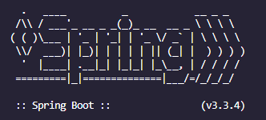

# SpringBoot API to be used for Backend Integration

## To Run Locally:

**Have a JDK installed on your machine**

> Open the terminal:  	`\CPS410-Project\>`

> Run the following: `\CPS410-Project\> cd backend`

> then: `\CPS410-Project\backend> ./mvwn spring-boot:run`

> SpringBoot is running if you see the following:

> Head to [http://localhost:8080/example](http://localhost:8080/example) to see an example response from the API.

> or try [http://localhost:8080/example?name=Thomas](http://localhost:8080/example?name=Thomas) to see what happens when you pass a parameter.

